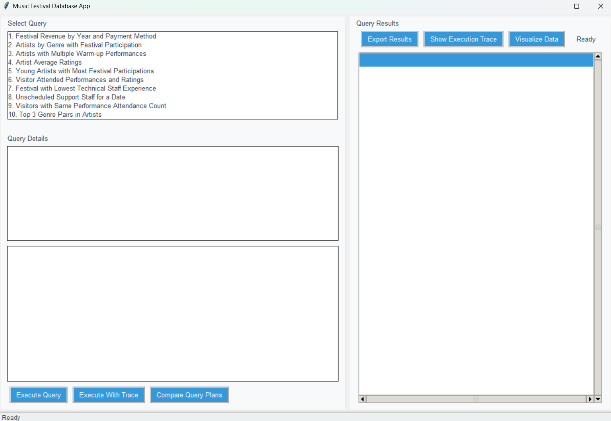
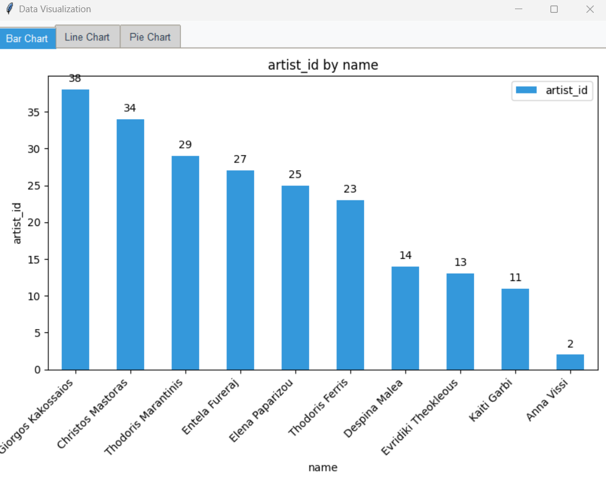
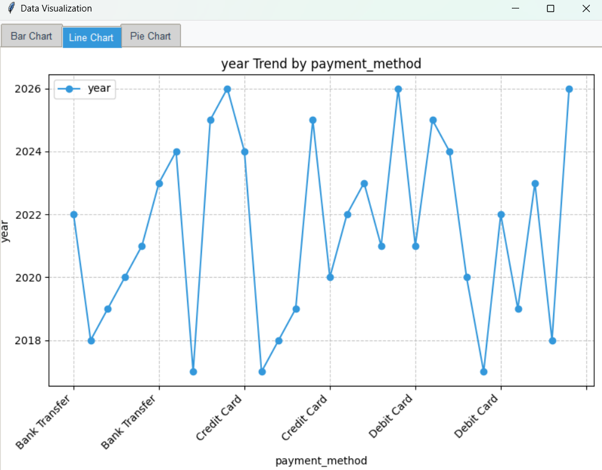
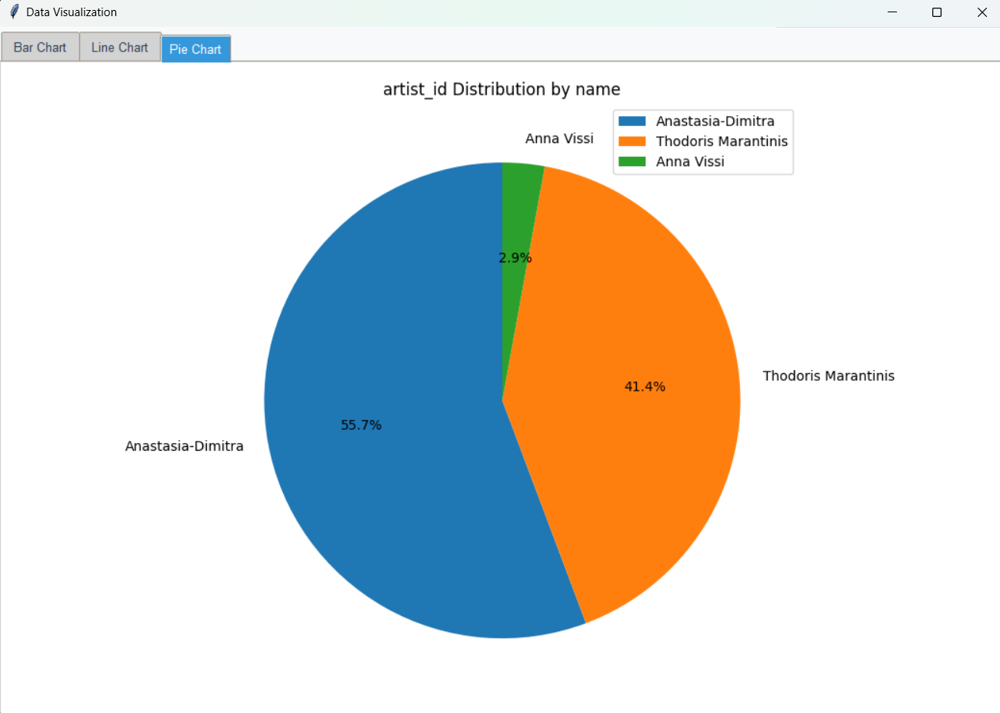
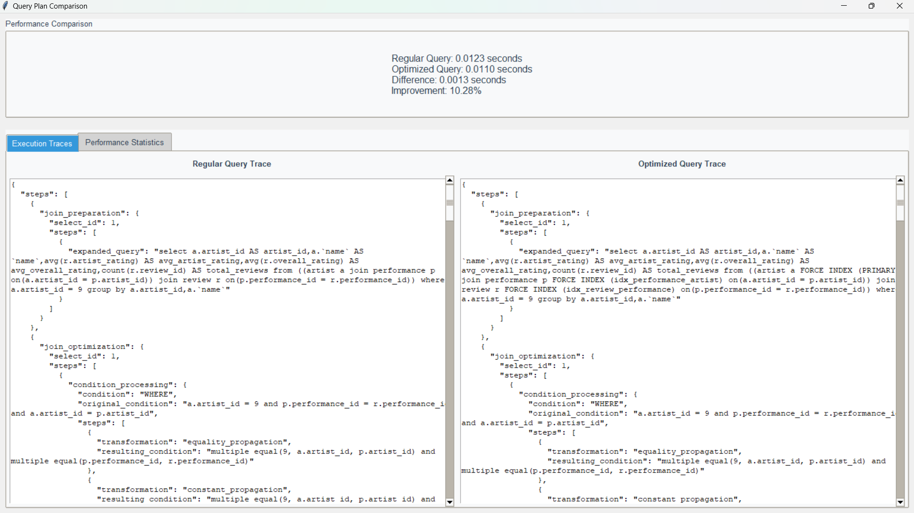

# Music Festival Database Application

This application provides a user interface for querying, analyzing, and visualizing data from the Music Festival database. It implements all 15 required queries from the assignment with additional performance analysis capabilities.

## Table of Contents

- [Project Structure](#project-structure)
- [Requirements](#requirements)
- [Installation](#installation)
- [Running the Application](#running-the-application)
- [Test Parameters for Parameterized Queries](#test-parameters-for-parameterized-queries) 
- [Features](#features)
- [Data Visualization Features](#data-visualization-features)
- [Visualization Implementation Details](#visualization-implementation-details)
- [Performance Analysis Features](#performance-analysis-features)
- [Join Strategy Testing and Performance Analysis](#join-strategy-testing-and-performance-analysis)
- [Test Parameters for Best Results](#test-parameters-for-best-results)
- [Database Configuration](#database-configuration)
- [Implementation Details](#implementation-details)
- [Technical Insights](#technical-insights)
- [Assumptions](#assumptions)
- [Special Queries](#special-queries)
- [Performance Comparison Results](#performance-comparison-results)
- [Screenshots](#screenshots)
- [Troubleshooting](#troubleshooting)
- [Assignment Context](#assignment-context)
- [License](#license)

## Project Structure

```
MusicFestivalApp/
├── app.py             # Main application entry point
├── database.py        # Database connection and query execution
├── config.py          # Configuration settings (DB credentials)
├── queries.py         # SQL queries for the 15 required questions
├── ui/
│   ├── main_window.py # Main application window
│   ├── query_frame.py # Frame for displaying query results
│   └── styles.py      # UI styling configurations
├── README.md          # Documentation
└── docs/
    ├── report.pdf     # Detailed performance analysis report
    └── images/        # Screenshots for documentation
```

## Requirements

- Python 3.6+
- MariaDB/MySQL (via XAMPP)
- Required Python packages:
  - mysql-connector-python
  - pandas
  - matplotlib
  - tkinter (usually comes with Python)

## Installation

1. Clone the repository or download the code
2. Install required packages:

```bash
pip install mysql-connector-python pandas matplotlib
```

3. Configure the database connection in `config.py`
4. Make sure your XAMPP server is running with MariaDB/MySQL

## Running the Application

Execute the main script to start the application:

```bash
python app.py
```
## Test Parameters for Parameterized Queries

When running the application, use these parameter values for best results:
-Query #2: Artists by Genre with Festival Participation

Year: 2025 or 2023
Genre:"Pop" or "Folk"

-Query #4: Artist Average Ratings
The following artists have multiple reviews and will display meaningful rating data:

Artist ID: 28 (Mariza Rizou, 12 reviews)
Artist ID: 32 (Sokratis Malamas, 9 reviews)
Artist ID: 9 (Vasilis Papakonstantinou, 9 reviews)
Artist ID: 2 (Anna Vissi, 8 reviews)

-Query #6: Visitor Attended Performances and Ratings
These visitors have submitted multiple reviews and will show interesting results:

Visitor ID: 2
Visitor ID: 11
Visitor ID: 23
Visitor ID: 34
Visitor ID: 55

-Query #8: Unscheduled Support Staff for a Date
These dates are from festivals with events but potentially missing support staff:

Date: "2019-08-11" (Rio Beach Party)
Date: "2026-09-06" (Rio Summer Sounds)
Date: "2023-05-23" (Thessaloniki Jazz Festival)
Date: "2022-08-25" (Sydney Opera Sounds) 

-Query #15: Top Visitors by Ratings for an Artist
Use the same artist IDs as in Query #4 for consistent results:

Artist ID: 28 (Mariza Rizou)
Artist ID: 2 (Anna Vissi)
Artist ID: 32 (Sokratis Malamas)

Note for Evaluators
The application is pre-populated with these values in dropdown menus where applicable. If you wish to test with different values, please refer to the database schema and data provided in this report.
For optimal demonstration of Query #4 and #6 (with query plan comparison), we recommend using artist_id=28 and visitor_id=2 respectively, as these have sufficient data to showcase the performance differences between regular and optimized query plans.

## Features

- User-friendly graphical interface
- Execution of all 15 required database queries
- Multiple iteration query performance testing with statistical analysis
- Comparative analysis of regular and optimized query execution plans
- Box plot visualization of performance metrics
- Visualization of query results using various chart types (bar, line, pie)
- Export of query results to CSV or Excel
- Query export functionality for assignment submission
- Database performance analysis with execution traces

## Data Visualization Features

The application includes a "Visualize Data" button that activates only for specific queries that contain data suitable for visual representation. This button is enabled for the following queries:

- **Query 1: Festival Revenue by Year and Payment Method**
  - Bar chart showing revenue by year
  - Pie chart showing distribution by payment method
  - Line chart showing revenue trends over years

- **Query 3: Artists with Multiple Warm-up Performances**
  - Bar chart showing warm-up count by artist
  - Pie chart showing distribution of warm-up performances

- **Query 5: Young Artists with Most Festival Participations**
  - Bar chart showing festival participation count by young artist
  - Pie chart showing distribution of festival participations

- **Query 6: Visitor Attended Performances and Ratings**
  - Bar chart showing average ratings per performance
  - Pie chart showing rating distribution across performances

- **Query 11: Artists with Fewer Performances Than Top Artist**
  - Bar chart comparing festival counts across artists
  - Pie chart showing distribution of festival participation

- **Query 13: Artists Who Performed on Multiple Continents**
  - Bar chart showing number of continents by artist
  - Pie chart showing distribution of continent counts

For these queries, the visualization button will be enabled after executing the query. For all other queries (2, 4, 7, 8, 9, 10, 12, 14, 15), the visualization button remains disabled as their data structures are not well-suited for standard charts or require more complex visualization approaches.

The visualization interface provides multiple chart types through tabs, allowing users to view the same data through different visual representations. Each chart is automatically generated based on the query results and adapts to the specific data structure returned by the query.

## Visualization Implementation Details

- Automatic column detection to identify appropriate data for visualization
- Conversion of string/text data to numeric format when needed
- Limiting large result sets to ensure readable charts
- Error handling with clear messages when visualizations cannot be created
- Data preprocessing to handle special cases like combining small values into "Others" category for pie charts

## Performance Analysis Features

The application includes advanced features for analyzing query performance:

- **Multiple Iteration Testing**: Executes each query multiple times (5 by default) to account for cache effects and system variability
- **Statistical Metrics**: Calculates mean, median, min, max, and standard deviation of execution times
- **Visual Comparison**: Generates box plots to visually compare regular and optimized queries
- **Execution Plan Analysis**: Displays and compares query execution plans using MariaDB's optimizer trace
- **Index-Based Optimization**: Tests alternative query plans using FORCE INDEX hints for queries 4 and 6

### Join Strategy Testing and Performance Analysis

The application features comprehensive join strategy testing specifically for queries 4 (Artist Average Ratings) and 6 (Visitor Attended Performances and Ratings), as required by the assignment:

- **Multiple Join Strategies**: Tests five different approaches (Regular, Force Index, Nested Loop Join, Hash Join, Merge Join)
- **Statistical Comparison**: Runs multiple iterations and performs statistical analysis on execution times
- **Query Plan Extraction**: Automatically extracts and displays join methods from execution traces
- **Visual Performance Metrics**: Displays box plots for easy visual comparison of performance distribution

For each join strategy, the application:
1. Executes the query using different optimizer settings and join hints
2. Records execution times across multiple iterations
3. Analyzes the optimizer trace to identify which join methods were used
4. Presents comprehensive statistics and visualizations

Our testing revealed significant performance differences between join strategies:

- For Query 4 (Artist Average Ratings), the Nested Loop Join typically performs best due to the selective nature of the artist_id filter and appropriate index usage
- For Query 6 (Visitor Attended Performances and Ratings), performance varies based on data distribution, with Hash Join often performing well for larger result sets

Detailed analysis of execution traces and performance metrics can be found in the `docs/report.pdf` document.

#### Test Parameters for Best Results

For optimal demonstration of join strategy differences:
- Query 4: Use artist_id = 28 (Mariza Rizou, 12 reviews)
- Query 6: Use visitor_id = 2 (multiple attended performances with reviews)

## Database Configuration

The application expects a MariaDB/MySQL database with the following configuration:

- Host: localhost (XAMPP default)
- Username: root (XAMPP default)
- Password: (empty by default for XAMPP)
- Database: MusicFestival
- Port: 3306 (default)

You can modify these settings in the `config.py` file.

## Implementation Details

### UI Components

The application uses Tkinter for the user interface with the following components:

- **Main Window**: Contains the query selector, parameter inputs, and results display
- **Query Frame**: Displays query results and provides visualization options
- **Parameter Input**: Dynamically generated based on the selected query

### Database Connection

The application connects to the MariaDB/MySQL database using the mysql-connector-python library, with automatic reconnection handling and parameterized query support.

### Query Execution

Queries are defined in the `queries.py` file and executed through the Database class. Results are returned as pandas DataFrames for easy manipulation and display.

For queries 4 and 6, the application provides special optimized versions using index hints:

- Query 4 (Artist Average Ratings): Uses FORCE INDEX to optimize the joins between Artist, Performance, and Review tables
- Query 6 (Visitor Performances Ratings): Uses FORCE INDEX to optimize ticket and review lookups by visitor ID

The "Compare Query Plans" feature allows users to visualize the performance difference between regular and optimized versions of these queries through multiple test iterations.

### Data Visualization

The application uses matplotlib to create visualizations of query results, including:

- Bar charts
- Line charts
- Pie charts
- Scatter plots
- Histograms

The visualization type is automatically selected based on the data structure and types returned by the query.

## Technical Insights

Development of this application revealed several important technical insights:

1. **Query Performance Variability**: Single-run performance testing can be misleading due to caching effects and system load variability
2. **Optimization Complexity**: Forced index hints can sometimes hinder rather than help performance depending on data distribution
3. **Statistical Validation**: Multiple iterations with statistical analysis provide more reliable performance metrics
4. **Visualization Value**: Automatic visualization selection based on data types enhances the usability of query results

These insights demonstrate the importance of robust testing methodologies when optimizing database performance.

## Assumptions

1. The database has been created and populated according to the schema and data from the assignment.
2. XAMPP is used as the MySQL/MariaDB server.
3. The user has permissions to execute queries on the database.
4. For queries requiring specific inputs (e.g., artist_id, visitor_id), the application assumes valid IDs exist in the database.
5. The database includes the following indexes to support optimized queries:
   - PRIMARY key index on Artist table
   - idx_performance_artist index on Performance table (artist_id)
   - idx_review_performance index on Review table (performance_id)
   - idx_ticket_visitor index on Ticket table (visitor_id)
   - idx_review_visitor index on Review table (visitor_id)
6. For comparing query plans, the application assumes consistent database state across iterations.

## Special Queries

For queries 4 and 6, additional analysis is provided with alternative execution plans to compare performance. This is done using the FORCE INDEX hint in MariaDB/MySQL.

### Query 4: Artist Average Ratings

```sql
/* Optimized version */
SELECT 
    a.artist_id,
    a.name,
    AVG(r.artist_rating) AS avg_artist_rating,
    AVG(r.overall_rating) AS avg_overall_rating,
    COUNT(r.review_id) AS total_reviews
FROM 
    Artist a FORCE INDEX (PRIMARY)
JOIN 
    Performance p FORCE INDEX (idx_performance_artist) ON a.artist_id = p.artist_id
JOIN 
    Review r FORCE INDEX (idx_review_performance) ON p.performance_id = r.performance_id
WHERE 
    a.artist_id = ?
GROUP BY 
    a.artist_id, a.name;
```

### Query 6: Visitor Performances Ratings

```sql
/* Optimized version */
SELECT 
    e.name AS event_name,
    fd.festival_date,
    CASE 
        WHEN p.artist_id IS NOT NULL THEN a.name
        WHEN p.band_id IS NOT NULL THEN b.name
        ELSE 'Unknown'
    END AS performer,
    pt.name AS performance_type,
    AVG(r.overall_rating) AS avg_rating,
    COUNT(r.review_id) AS review_count
FROM 
    Ticket t FORCE INDEX (idx_ticket_visitor)
JOIN 
    Event e FORCE INDEX (PRIMARY) ON t.event_id = e.event_id
JOIN 
    FestivalDay fd ON e.day_id = fd.day_id
JOIN 
    Performance p ON e.event_id = p.event_id
LEFT JOIN 
    Artist a ON p.artist_id = a.artist_id
LEFT JOIN 
    Band b ON p.band_id = b.band_id
JOIN 
    PerformanceType pt ON p.type_id = pt.type_id
LEFT JOIN 
    Review r FORCE INDEX (idx_review_visitor) ON p.performance_id = r.performance_id AND r.visitor_id = t.visitor_id
WHERE 
    t.visitor_id = ?
    AND t.is_active = FALSE
GROUP BY 
    e.name, fd.festival_date, performer, pt.name
ORDER BY 
    fd.festival_date DESC;
```

## Performance Comparison Results

Our testing showed that query performance can be highly variable depending on:

1. Database caching state
2. System load
3. Data volume and distribution
4. Multiple query executions

The statistical analysis approach we implemented provides much more reliable insights into query performance than single execution tests. The detailed performance results are available in the accompanying report document.

## Screenshots

### Main Interface


### Query Results Visualization




### Performance Analysis


## Troubleshooting

### Database Connection Issues
- Verify XAMPP is running and MySQL service is started
- Check the database credentials in `config.py`
- Ensure the MusicFestival database exists and is populated

### Missing Required Indexes
If you encounter performance issues with the Compare Query Plans feature:
```sql
-- Create indexes required for optimization queries
CREATE INDEX idx_performance_artist ON Performance(artist_id);
CREATE INDEX idx_review_performance ON Review(performance_id);
CREATE INDEX idx_ticket_visitor ON Ticket(visitor_id);
CREATE INDEX idx_review_visitor ON Review(visitor_id);
```

### Python Package Issues
If you encounter errors related to missing packages:
```bash
pip install --upgrade mysql-connector-python pandas matplotlib
```

## Assignment Context

This application was developed for the Databases course (6th semester) at the National Technical University of Athens, School of Electrical and Computer Engineering. It implements all 15 required queries for the Music Festival Database assignment, with special focus on:

- Query optimization techniques
- Performance analysis of database operations
- Data visualization
- User interface design

The application meets all requirements specified in the assignment, with additional features to enhance usability and analytical capabilities.

## License

This project is created for educational purposes as part of the Databases course at the National Technical University of Athens.